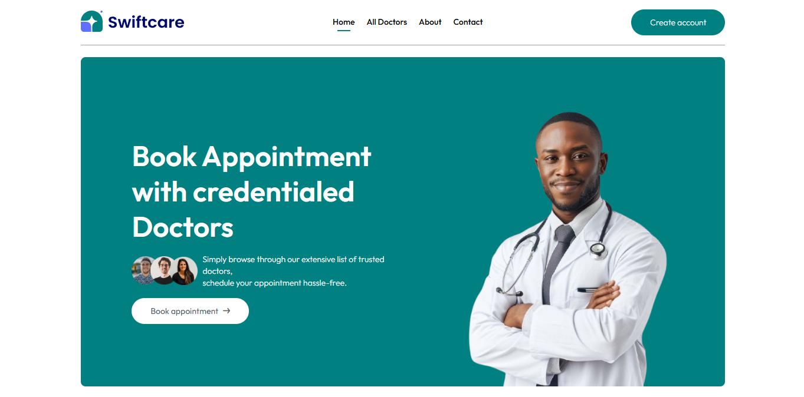

# SWIFTCARE PLATFORM

[Live Demo](https://swiftcare-platform.vercel.app/)



A full-stack healthcare appointment and management platform, also known as **swiftcare**, designed to connect patients with credentialed doctors, streamline appointment bookings, and provide robust admin and doctor dashboards.

---

## Table of Contents

- [Features](#features)
- [Project Structure](#project-structure)
- [Tech Stack](#tech-stack)
- [Getting Started](#getting-started)
- [Scripts](#scripts)
- [Deployment](#deployment)
- [Contact](#contact)
- [License](#license)

---

## Features

### Patient Portal (Frontend)
- Browse doctors by specialty
- View doctor profiles, availability, and fees
- Book appointments and manage bookings
- Secure authentication and profile management
- Online payments (Razorpay integration)
- View appointment history and health records

### Doctor Dashboard (Admin Panel)
- Manage profile, availability, and fees
- View and manage appointments
- Mark appointments as completed/cancelled
- Access patient details for scheduled visits

### Admin Dashboard
- Add, edit, and remove doctors
- View all appointments and platform statistics
- Manage doctor availability and specialties
- Cancel appointments on behalf of users

---

## Project Structure

SWIFTCARE PLATFORM/ │ ├── .gitignore ├── README.md ├── admin/ # Admin & Doctor dashboard (React + Vite) │ ├── public/ │ ├── src/ │ │ ├── components/ │ │ ├── context/ │ │ ├── pages/ │ │ └── ... │ ├── package.json │ └── ... │ ├── Backend/ # Backend API (Node.js + Express + MongoDB) │ ├── config/ │ ├── controllers/ │ ├── middlewares/ │ ├── models/ │ ├── routes/ │ ├── server.js │ ├── package.json │ └── ... │ ├── Frontend/ # Patient-facing frontend (React + Vite) │ ├── public/ │ ├── src/ │ │ ├── assets/ │ │ ├── components/ │ │ ├── context/ │ │ ├── pages/ │ │ └── ... │ ├── package.json │ └── ... │ └── .vscode/ # VSCode settings


---

## Tech Stack

- **Frontend:** React, Vite, Tailwind CSS, Axios, React Router, React Toastify
- **Backend:** Node.js, Express, MongoDB, Mongoose, JWT, Cloudinary, Multer, Razorpay
- **Admin Panel:** React, Vite, Tailwind CSS
- **Deployment:** Vercel

---

## Getting Started

### Prerequisites

- Node.js (v18+ recommended)
- npm or yarn

### Installation

1. **Clone the repository**
    ```sh
    git clone <repository-url>
    cd SWIFTCARE-PLATFORM
    ```

2. **Install dependencies for each package**

    - **Frontend**
      ```sh
      cd Frontend
      npm install
      ```

    - **Backend**
      ```sh
      cd ../Backend
      npm install
      ```

    - **Admin**
      ```sh
      cd ../admin
      npm install
      ```

3. **Set up environment variables**

    - Copy `.env.example` to `.env` in each package and fill in the required values.

4. **Run the development servers**

    - **Frontend**
      ```sh
      npm run dev
      ```
    - **Backend**
      ```sh
      npm run server
      ```
    - **Admin**
      ```sh
      npm run dev
      ```

---

## Scripts

Each package ([Frontend](http://_vscodecontentref_/5), [Backend](http://_vscodecontentref_/6), [admin](http://_vscodecontentref_/7)) provides standard scripts:

- `npm run dev` – Start development server
- `npm run build` – Build for production
- `npm run preview` – Preview production build
- `npm run lint` – Lint the codebase

---

## Deployment

- The project is configured for deployment on [Vercel](https://vercel.com/) with custom [vercel.json](http://_vscodecontentref_/8) files in each package.
- Backend is deployed as a serverless function.
- Frontend and Admin are deployed as static sites.

---

## Contact

For support or inquiries, contact:  
goodluckikenna215@gmail.com

---

## License

This project is licensed under the MIT License.

---

## Acknowledgements

- All contributors and open-source libraries used in this project.