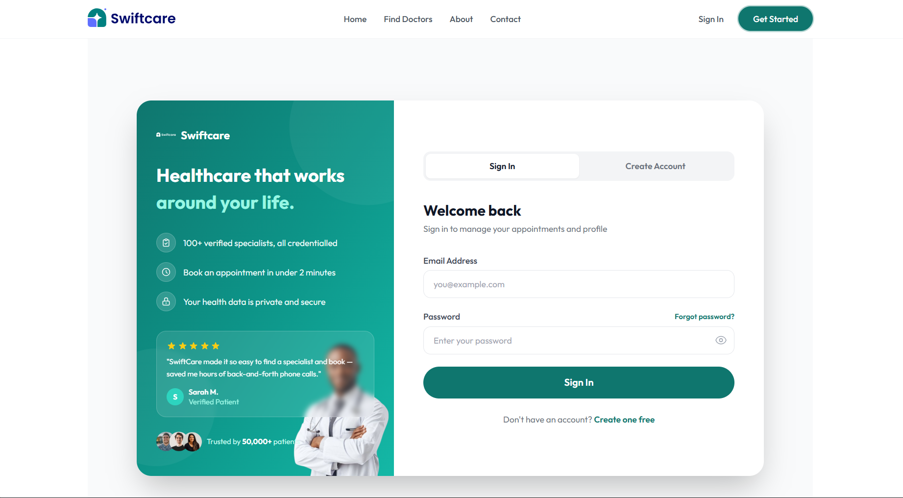

# SwiftCare Platform

> A full-stack healthcare appointment and management platform connecting patients with credentialed doctors, streamlining bookings, and providing powerful dashboards for doctors and admins.

**Live Links**

| App                     | URL                                                                     |
| ----------------------- | ----------------------------------------------------------------------- |
| 🏥 Patient Portal       | [swiftcare-platform.vercel.app](https://swiftcare-platform.vercel.app/) |
| 🩺 Doctor / Admin Panel | [swiftcare-admindoc.vercel.app](https://swiftcare-admindoc.vercel.app/) |
| ⚙️ Backend API          | [swiftcare-api.vercel.app](https://swiftcare-api.vercel.app/)           |



---

## Table of Contents

- [Features](#features)
- [Tech Stack](#tech-stack)
- [Project Structure](#project-structure)
- [Getting Started](#getting-started)
- [Environment Variables](#environment-variables)
- [Scripts](#scripts)
- [Deployment](#deployment)
- [Contact](#contact)
- [License](#license)

---

## Features

### Patient Portal

- Browse and search doctors by speciality
- View doctor profiles, experience, availability, and consultation fees
- Book appointments with real-time slot selection
- **Paystack** payment integration (redirect flow)
- Email confirmation and cancellation notifications via Gmail
- Email verification for new accounts
- Forgot password / secure password reset (crypto token, 1hr expiry)
- Manage profile, photo, address, and personal details
- View full appointment history — upcoming and past

### Doctor Dashboard

- Manage profile, availability toggle, consultation fees, and clinic address
- View and manage all patient appointments
- Mark appointments as completed or cancelled
- Receive email alerts when appointments are cancelled

### Admin Dashboard

- Add, edit, and manage doctor profiles (with Cloudinary image upload)
- View all platform appointments and statistics
- Cancel appointments on behalf of users
- Full doctor list management

---

## Tech Stack

| Layer            | Technologies                                                         |
| ---------------- | -------------------------------------------------------------------- |
| **Frontend**     | React 18, Vite, Tailwind CSS, React Router v6, Axios, React Toastify |
| **Backend**      | Node.js, Express, MongoDB, Mongoose, JWT, Bcrypt                     |
| **Payments**     | Paystack (server-side redirect flow)                                 |
| **Email**        | Nodemailer (Gmail App Password)                                      |
| **File Storage** | Cloudinary, Multer                                                   |
| **Logging**      | Pino                                                                 |
| **Deployment**   | Vercel (frontend, admin, backend as serverless)                      |

---

## Project Structure

```
SWIFTCARE_PLATFORM/
│
├── Frontend/                  # Patient-facing app (React + Vite)
│   ├── public/
│   └── src/
│       ├── assets/
│       ├── components/        # Navbar, Footer, Header, DoctorCard, etc.
│       ├── context/           # AppContext (global state)
│       ├── hooks/
│       └── pages/             # Home, Doctors, Appointment, Login, etc.
│
├── admin/                     # Doctor & Admin dashboard (React + Vite)
│   └── src/
│       ├── components/        # Navbar, Sidebar
│       ├── context/           # AdminContext, DoctorContext
│       └── pages/
│           ├── Admin/         # Dashboard, Appointments, AddDoctor, DoctorList
│           └── Doctor/        # Dashboard, Appointments, Profile
│
├── Backend/                   # REST API (Node.js + Express)
│   ├── config/                # DB, Cloudinary, Mailer, Logger
│   ├── controllers/           # userController, doctorController, adminController
│   ├── middlewares/           # authUser, authDoctor, authAdmin, multer
│   ├── models/                # User, Doctor, Appointment schemas
│   ├── routes/                # userRoute, doctorRoute, adminRoute
│   ├── utils/                 # emailTemplates
│   ├── server.js
│   └── .env.example
│
└── README.md
```

---

## Getting Started

### Prerequisites

- Node.js v18+
- npm
- MongoDB Atlas account
- Cloudinary account
- Paystack account (test keys work fine locally)
- Gmail account with an [App Password](https://support.google.com/accounts/answer/185833) enabled

### Installation

1. **Clone the repository**

   ```bash
   git clone https://github.com/Ikenna-Lucky/SWIFTCARE_PLATFORM.git
   cd SWIFTCARE_PLATFORM
   ```

2. **Install dependencies for all three packages**

   ```bash
   cd Frontend && npm install
   cd ../admin && npm install
   cd ../Backend && npm install
   ```

3. **Set up environment variables** (see [Environment Variables](#environment-variables) below)

4. **Start all three development servers** (each in its own terminal)

   ```bash
   # Terminal 1 — Backend
   cd Backend && npm run server

   # Terminal 2 — Frontend
   cd Frontend && npm run dev

   # Terminal 3 — Admin
   cd admin && npm run dev
   ```

---

## Environment Variables

Copy `Backend/.env.example` to `Backend/.env` and fill in the values:

```env
MONGODB_URI=           # MongoDB Atlas connection string
JWT_SECRET=            # Any long random string
CLOUDINARY_NAME=
CLOUDINARY_API_KEY=
CLOUDINARY_SECRET_KEY=
ADMIN_EMAIL=           # Admin login email
ADMIN_PASSWORD=        # Admin login password
PORT=4000
DB_NAME=prescripto

# Email notifications
GMAIL_USER=            # your@gmail.com
GMAIL_APP_PASSWORD=    # 16-character Gmail App Password

# Payments
PAYSTACK_SECRET_KEY=   # sk_test_... or sk_live_...

# Password reset & email verification links
FRONTEND_URL=          # e.g. http://localhost:5173 or your deployed URL
```

For the Frontend and Admin, set `VITE_BACKEND_URL` in their respective `.env` files:

```env
VITE_BACKEND_URL=http://localhost:4000
```

---

## Scripts

Run these from inside each package directory (`Frontend/`, `Backend/`, `admin/`):

| Command           | Description                                 |
| ----------------- | ------------------------------------------- |
| `npm run dev`     | Start development server                    |
| `npm run build`   | Build for production                        |
| `npm run preview` | Preview production build locally            |
| `npm run server`  | Start backend with nodemon _(Backend only)_ |
| `npm run lint`    | Lint the codebase                           |

---

## Deployment

All three apps are deployed on [Vercel](https://vercel.com/) using `vercel.json` configurations in each package:

- **Backend** — deployed as Express serverless functions
- **Frontend** — deployed as a static React/Vite site
- **Admin** — deployed as a static React/Vite site

Set all environment variables in each Vercel project's dashboard under **Settings → Environment Variables**.

---

## Contact

For support or inquiries: **goodluckikenna215@gmail.com**

---

## License

This project is licensed under the [MIT License](LICENSE).
